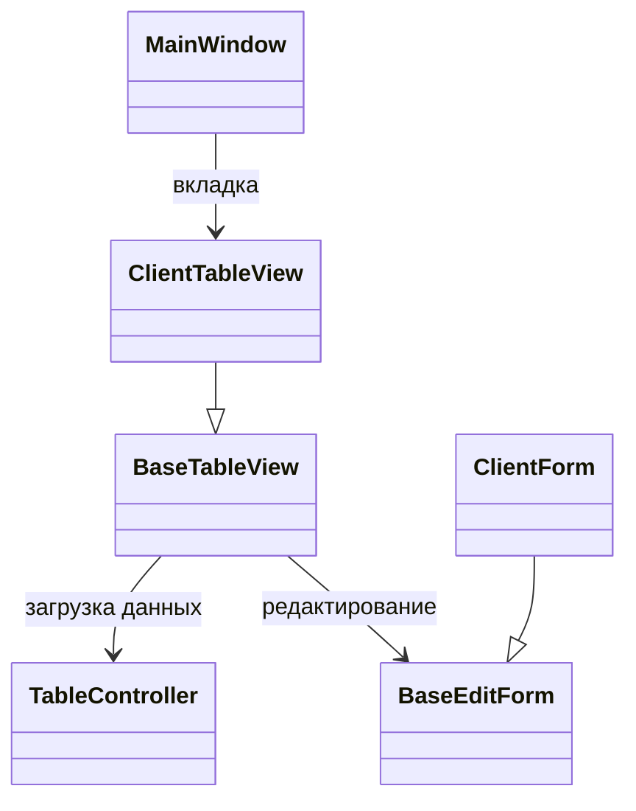

# Основные классы интерфейса

## Поток взаимодействия

1. `MainWindow` создаёт вкладки с конкретными таблицами и подписывается на сигнал `data_loaded`, чтобы отображать число записей.
2. Каждый наследник `BaseTableView` настраивает `TableController`, передавая сервисные функции для загрузки страниц и подсчёта записей. Контроллер обновляет модель и эмитит `data_loaded`.
3. `BaseTableView` обновляет таблицу и фильтры. При редактировании открывается форма, наследующая `BaseEditForm`; она сохраняет данные через сервисы и инициирует обновление представления.

## QSortFilterProxyModel

Для фильтрации таблиц используется стандартная `QSortFilterProxyModel`. Клик по заголовку открывает меню с полем ввода, которое устанавливает фильтр через `setFilterKeyColumn`.

## Ссылки

- [MainWindow](../ui/main_window.py)
- [BaseTableView](../ui/base/base_table_view.py)
- [TableController](../ui/base/table_controller.py)
- [BaseEditForm](../ui/base/base_edit_form.py)
- Пример таблицы: [ClientTableView](../ui/views/client_table_view.py)
- Пример формы: [ClientForm](../ui/forms/client_form.py)

