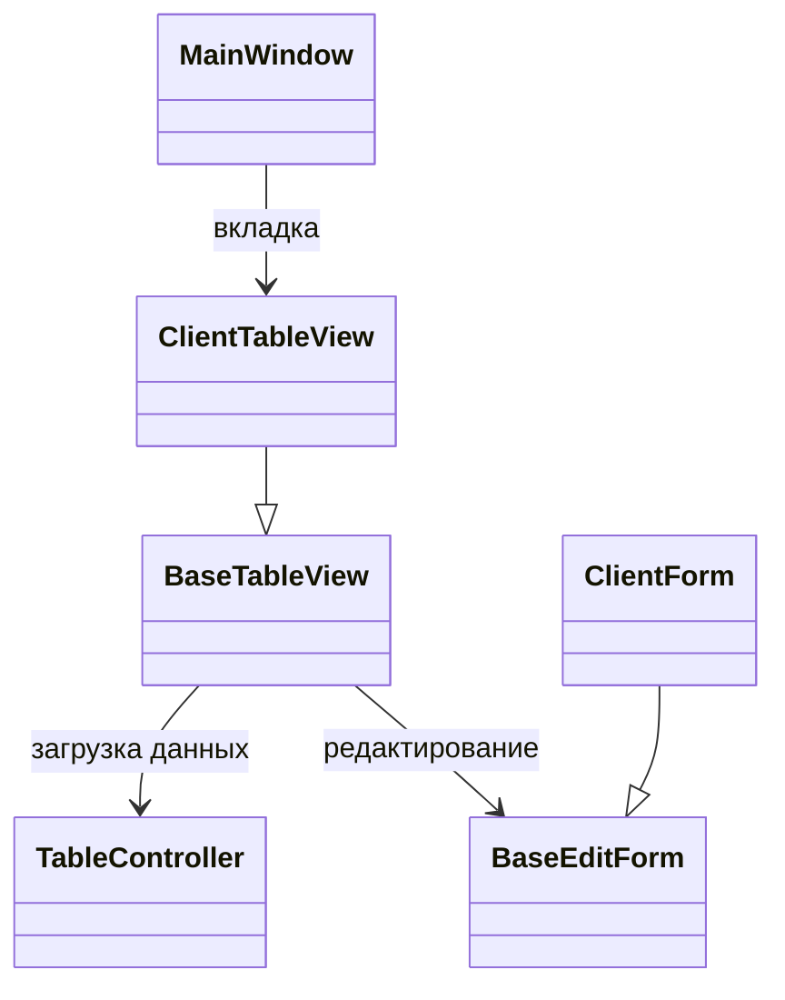

# Основные классы интерфейса



## Поток взаимодействия

1. `MainWindow` создаёт вкладки с конкретными таблицами и подписывается на сигнал `data_loaded`, чтобы отображать число записей.
2. Каждый наследник `BaseTableView` настраивает `TableController`, передавая сервисные функции для загрузки страниц и подсчёта записей. Контроллер обновляет модель и эмитит `data_loaded`.
3. `BaseTableView` обновляет таблицу и фильтры. При редактировании открывается форма, наследующая `BaseEditForm`; она сохраняет данные через сервисы и инициирует обновление представления.

## MultiFilterProxyModel

`MultiFilterProxyModel` расширяет `QSortFilterProxyModel` и позволяет задавать
отдельные текстовые фильтры для нескольких столбцов одновременно. Она хранит
состояние фильтров и применяется вместе с `FilterHeaderView`, чтобы заголовки
таблицы управляли выборкой.

## Пример таблицы с `FilterHeaderView` и `MultiFilterProxyModel`

```python
from PySide6.QtWidgets import QTableView
from ui.common.filter_header_view import FilterHeaderView
from ui.common.multi_filter_proxy_model import MultiFilterProxyModel


class MyTableView(QTableView):
    def __init__(self, parent=None):
        super().__init__(parent)
        source_model = ...
        proxy = MultiFilterProxyModel(self)
        proxy.setSourceModel(source_model)
        self.setModel(proxy)

        header = FilterHeaderView(self)
        self.setHorizontalHeader(header)
        header.filter_changed.connect(proxy.set_filter)
```

## Ссылки

- [MainWindow](../ui/main_window.py)
- [BaseTableView](../ui/base/base_table_view.py)
- [TableController](../ui/base/table_controller.py)
- [BaseEditForm](../ui/base/base_edit_form.py)
- Пример таблицы: [ClientTableView](../ui/views/client_table_view.py)
- Пример формы: [ClientForm](../ui/forms/client_form.py)

